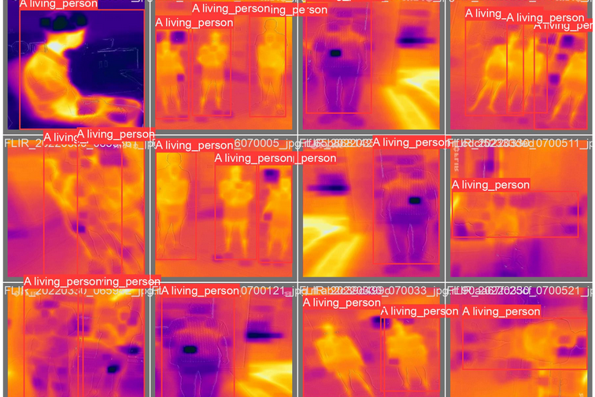

# Infravision: Integrated System for TIR Human Detection

**Infravision** is a cutting-edge project designed to enhance surveillance capabilities by leveraging **thermal infrared (TIR) imaging** for human detection. Unlike traditional RGB images, TIR images excel in low-light and nighttime conditions, making it a powerful tool for robust and reliable detection of human heat signatures. This system integrates real-time alerts, GPS coordinates, and mobile application functionality to provide enhanced security and rapid decision-making.



## Table of Contents

- [Project Overview](#project-overview)
- [Key Features](#key-features)
- [Human Detection Approaches](#human-detection-approaches)
- [System Integration](#system-integration)
- [Getting Started](#getting-started)
- [Installation](#installation)
- [Usage](#usage)
- [Contributing](#contributing)
- [License](#license)

## Project Overview

Infravision provides an integrated solution for human detection using thermal infrared imaging technology, focusing on improving surveillance in challenging environments. The system can detect humans based on the unique heat signatures they emit, offering advantages in low visibility conditions such as at night or in fog.

This project aims to:
- Provide reliable human detection using TIR.
- Integrate detection with real-time alerts and GPS coordinates.
- Offer a holistic solution for enhanced security and decision-making.
- Evaluate various detection methods based on YOLO architectures.

## Key Features

- **Thermal Imaging Human Detection**: Detects human heat signatures in real-time using TIR.
- **Multiple YOLO-based Detection Models**:
  - **YOLOv3 from Scratch**: Implemented and trained on a custom dataset.
  - **Transfer Learning YOLOv3**: Fine-tuned using the PASCAL VOC dataset.
  - **YOLOv8**: Fine-tuned on a custom dataset to enhance detection accuracy.
- **Mobile Application Integration**: Real-time alerts with GPS coordinates sent via mobile application.
- **Versatility in Surveillance**: Applicable for various environments, including low-light and nighttime settings.
- **Rapid Decision Making**: Immediate detection and alerts facilitate quick and informed action.

## Human Detection Approaches

This project explores three primary approaches for human detection:

1. **YOLOv3 from Scratch**: Implementing the YOLOv3 architecture from the ground up and training it on a custom dataset tailored for human detection.
2. **Transfer Learning YOLOv3**: Utilizing a pre-trained YOLOv3 model on the PASCAL VOC dataset and fine-tuning it on the project’s custom dataset.
3. **YOLOv8 Fine-tuning**: Leveraging the latest YOLOv8 architecture, fine-tuned on the custom dataset for superior performance.

These approaches are evaluated for performance and reliability, with the goal of selecting the most effective human detection model for deployment in real-world scenarios.

## System Integration

The project integrates various components to form a holistic human detection system:

- **Thermal Imaging Camera**: Captures thermal images used for human detection.
- **YOLO-based Human Detection Models**: Detects humans based on thermal images.
- **Mobile Application**: Sends real-time alerts and GPS coordinates for rapid response.
- **Surveillance System**: A comprehensive solution that enhances security by detecting human presence, especially in challenging environments like nighttime or foggy areas.

## Getting Started

To get started with the **Infravision** system, you’ll need to follow the installation and setup instructions outlined below. Make sure you have the necessary hardware (thermal imaging camera) and software dependencies installed.

## Installation

1. **Clone the repository**:

   ```bash
   git clone https://github.com/yourusername/infravision.git
   cd infravision
